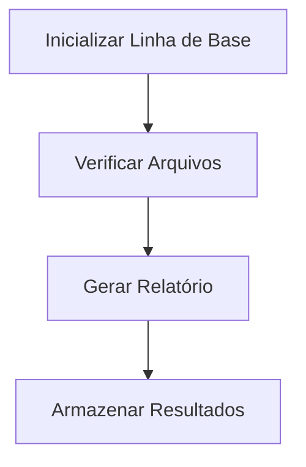

# File Integrity Monitor

## Problema

O monitor de integridade de arquivos é uma ferramenta de segurança que verifica a integridade de arquivos críticos em um sistema, garantindo que nenhum arquivo tenha sido alterado, adicionado ou excluído sem autorização. Isso é crucial para proteger contra ameaças como malware, intrusões e erros humanos.

## Recursos

- Inicializar uma linha de base de caminhos locais autorizados
- Verificar contra a linha de base
- Relatar arquivos adicionados/modificados/excluídos/não alterados
- Incluir/excluir globs
- Armazenamento SQLite para hashes
- Relatórios em JSON e Markdown
- Modelo de ameaça nos documentos
- Laboratório de amostras

## Arquitetura



## Tecnologias

- Python
- SQLite
- YAML
- Ruff
- Pytest

## Instalação

1. Clone o repositório:

```bash

```

2. Instale as dependências:

```bash
pip install -r requirements.txt
```

## Configuração

1. Copie `config.example.yaml` para `config/config.yaml`
2. Edite `config/config.yaml` com os caminhos e padrões de exclusão necessários

## Uso

- Inicializar linha de base:

```bash
python -m src.cli init
```

- Verificar arquivos:

```bash
python -m src.cli check
```

- Gerar relatório:

```bash
python -m src.cli report
```

## Segurança

- O monitor de integridade de arquivos é uma ferramenta defensiva e não ataca sistemas de terceiros.
- Todos os hashes são armazenados localmente e não são compartilhados.
- O projeto está licenciado sob a licença MIT.

## Testes

Execute os testes com:

```bash
pytest
```

## Capturas de Tela

[Adicione capturas de tela aqui]

## Estrutura do Projeto

```
file-integrity-guard/
├── src/
├── tests/
├── docs/
├── scripts/
├── config/
├── samples/
├── .github/workflows/
├── .env.example
├── .gitignore
├── LICENSE
├── CONTRIBUTING.md
├── requirements.txt
├── pyproject.toml
└── README.md
```

## Roadmap

- Adicionar suporte para notificações por e-mail
- Melhorar a interface de linha de comando
- Adicionar suporte para verificação remota

## Lições Aprendidas

- A importância de documentar bem o projeto
- A necessidade de testes abrangentes
- A importância da segurança defensiva

## Autor

Lucas Mesquita - [GitHub](https://github.com/lcsmqt)