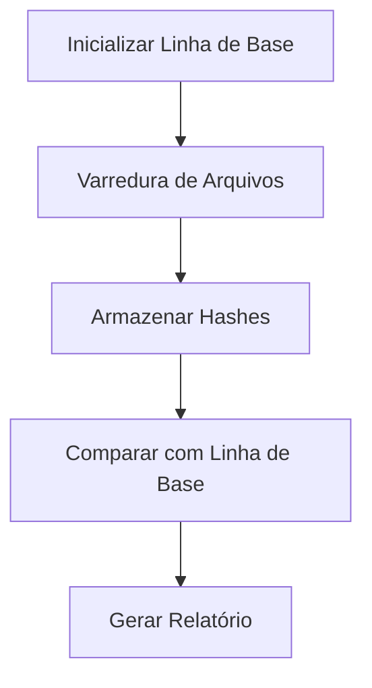

# Arquitetura do File Integrity Guard

## Visão Geral

O File Integrity Guard é um monitor defensivo de integridade de arquivos que:

1. Cria uma linha de base SHA-256 de arquivos locais autorizados
2. Compara o estado atual com a linha de base
3. Gera relatórios de alterações

## Componentes Principais

- **src/models.py**: Define estruturas de dados para arquivos, resultados de varredura e configuração.
- **src/hashing.py**: Calcula hashes SHA-256 e coleta metadados de arquivos.
- **src/store.py**: Armazenamento SQLite para a linha de base.
- **src/scanner.py**: Varredura recursiva de caminhos locais com filtros.
- **src/compare.py**: Compara arquivos atuais com a linha de base.
- **src/reporting.py**: Gera relatórios em JSON e Markdown.
- **src/cli.py**: Interface de linha de comando.

## Fluxo de Dados

## Segurança

- Apenas monitora arquivos locais autorizados
- Não acessa sistemas de terceiros
- Não armazena hashes em servidores remotos
- Não envia dados para APIs pagas

## Tecnologias

- Python 3.10+
- SQLite para armazenamento local
- YAML para configuração
- Ruff para linting
- Pytest para testes
